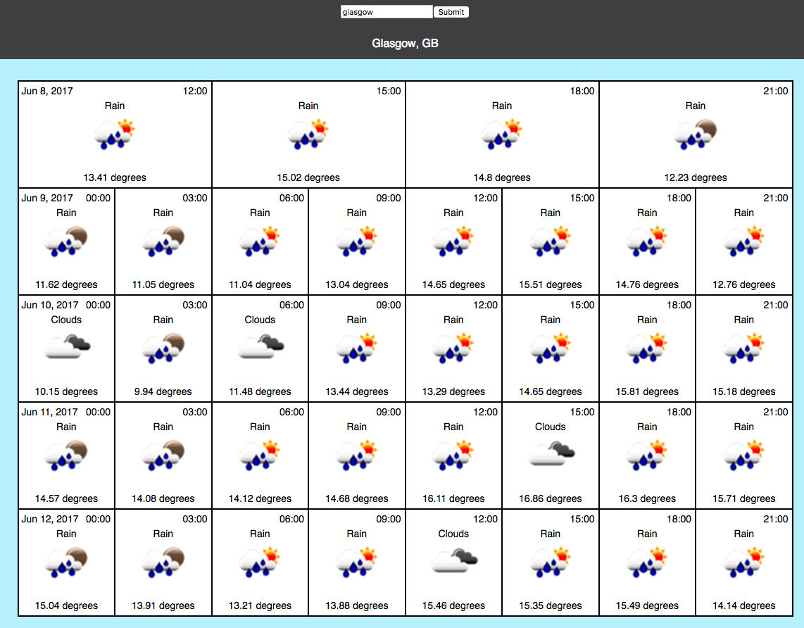

Weather Forecast

Find the weather forecast for any city.

To run this project locally, ensure you have [nodejs](https://nodejs.org/en/) installed

then navigate to the project root via your terminal and run either:

`yarn && yarn start ` (recommended, requires yarn to be installed globally `npm i yarn -g`),

or

`npm i && npm start`

